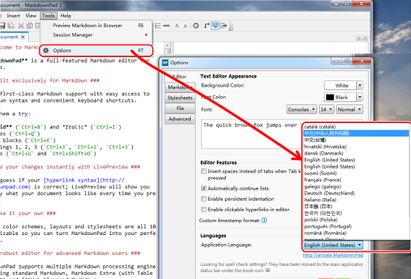
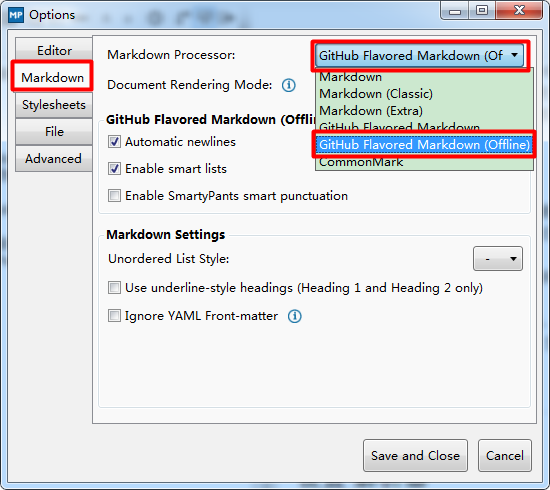
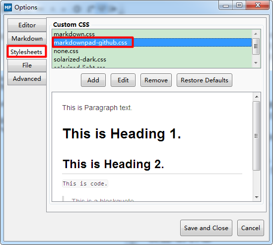
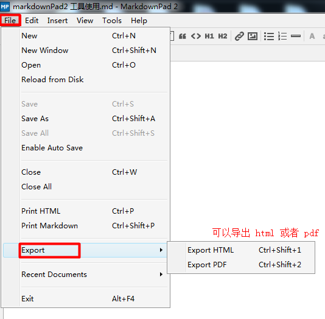

# markdown pad 2 安装 与 使用说明
MarkdownPad 2是一款不错的Markdown编辑器，具备所有Markdown的基本语法外支持一些特别的扩展，比如表格等。可以帮助你快速的将文本转换为美观的HTML/XHTML的网页格式代码！软件操作简单容易，上手很快。可让你可以即时预览转换后的样式的同时，又不会加入Office特有的编版码，有需要朋友可以进行尝试。

MarkdownPad 2软件功能特点：

1. 为你提供了语法高亮和方便的快捷键功能，给您最好的Markdown编写体验。
2. 无需猜测您的 语法 是否正确；每当您敲击键盘，实时预览功能都会立刻准确呈现出文档的显示效果。
3. 100%可自定义的字体、配色、布局和样式，让您可以将MarkdownPad配置的得心应手。
4. MarkdownPad支持多种解析引擎。
5. 有了标签式多文档界面、PDF 导出、内置的图片上传工具、会话管理、拼写检查、自动保存、语法高亮以及内置的 CSS 管理器，您可以随心所欲地使用 MarkdownPad。

## 安装
大部分的win7操作系统都可以直接安装使用。win10系统会有问题。
如果遇到提示安装 .net framework 4.0 ，那么就先安装 .net framework 4.0
如果遇到页面无法渲染出来的，请安装 awesomium_v1.6.6_sdk_win.exe
如果使用高级功能提示需要购买软件的，请输入秘钥

## 设置中文

## 工具栏介绍

## 设置 解析器

## 设置 css 风格

## 导出文件
markdown 可以导出为 html 或者 pdf
